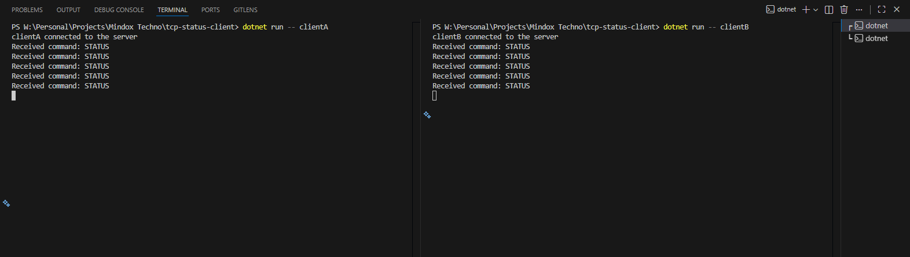
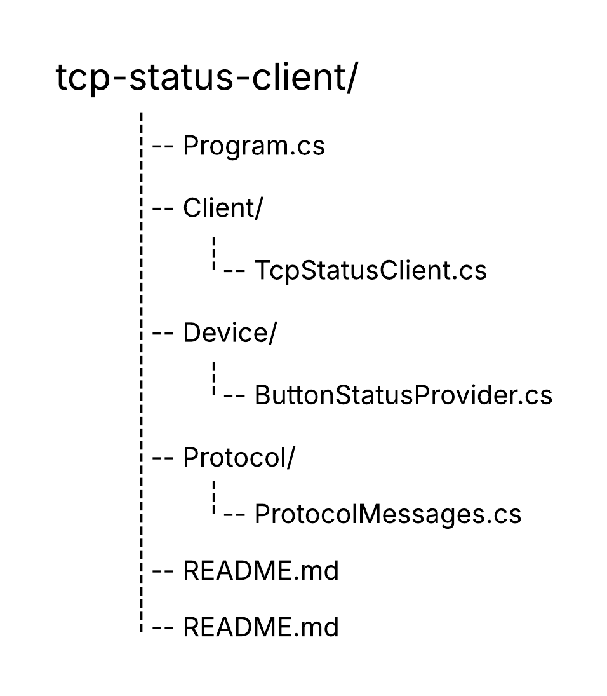

<div align="center">
  <h1="center">TCP/IP Status Monitoring System - Client</h1>
</div>




### The TCP Status Client is a C#/.NET–based TCP/IP client application that connects to the TCP Status Server to report device status. It supports acknowledgement of incoming commands, handles a 3-second processing delay for status requests, and responds with busy messages when necessary, following a custom command–response protocol.

### The client architecture emphasizes reliability and responsiveness, featuring asynchronous communication, simulated device button states, and robust error handling. It provides a production-ready foundation for multi-client monitoring systems, demonstrating clear separation of concerns, protocol compliance, and scalable support for concurrent connections to the server.

## Built With

- [![C#][CSharp]][CSharp-url]
- [![.NET][DotNet]][DotNet-url]

## Getting started

### Prerequisites

- DotNET: [DotNET download page](https://dotnet.microsoft.com/en-us/download/dotnet)

### Installation

1. Clone the repo
   ```bash
   git clone https://github.com/CharakaJith/tcp-status-client.git
   ```
2. Step into the project
   ```bash
   cd tcp-status-client
   ```

### Setup configurations

1. Create a `appsettings.json` in root folder
   ```bash
   echo. > appsettings.json
   ```
2. Open the `appsettings.json` and paste below

   ```json
   {
     "Server": {
       "Host": "127.0.0.1",
       "Port": 5000
     }
   }
   ```

### Run the project

1. Build the solution
   ```bash
   dotnet build tcp-status-client.sln
   ```
2. Start client with client_name flag
   ```bash
   dotnet run -- clientA
   ```
3. Start multiple clients (in separate terminal windows or tabs)
   ```bash
   dotnet run -- clientB
   dotnet run -- clientC
   ```

### Declaration

- This project, including all source code and documentation, was developed by me as part of the MindOx Techno Private Limited technical assessment.
- Product descriptions and documentation were reviewed and refined using ChatGPT to ensure proper grammar, clarity, and professional English.
- Guidance from ChatGPT was consulted for project organization and coding best practices. All server logic, protocol design, and implementation were completed independently by the author.

### References

- [.NET TCP/IP Networking Concepts](https://learn.microsoft.com/en-us/dotnet/fundamentals/networking/sockets/tcp-classes)
- [Simple TCP Server and Client](https://www.aicodesnippet.com/c-sharp/networking/simple-tcp-server-and-client-with-tcplistener-and-tcpclient.html)

## Contact

Email: [gunasinghe.info@gmail.com](mailto:gunasinghe.info@gmail.com) | LinkedIn: [Charaka Jith Gunasinghe](https://www.linkedin.com/in/charaka-gunasinghe/)

<!-- MARKDOWN LINKS & IMAGES -->

[CSharp]: https://img.shields.io/badge/C%23-239120?style=for-the-badge&logo=csharp&logoColor=white
[CSharp-url]: https://learn.microsoft.com/en-us/dotnet/csharp/
[DotNet]: https://img.shields.io/badge/.NET-512BD4?style=for-the-badge&logo=dotnet&logoColor=white
[DotNet-url]: https://dotnet.microsoft.com/
